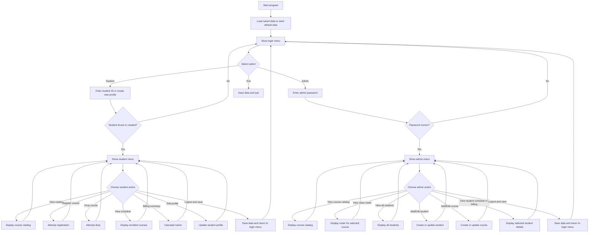

# unknownapp
This is an unknown application written in Java

---- For Submission (you must fill in the information below) ----
### Use Case Diagram

### Flowchart of the main workflow

### Prompts
- "Write a Python version of the 'View My Schedule' use case from a Java course enrollment system. The Python program should load students and courses from JSON files, ask for a student ID, show all currently enrolled courses, display each course's code, title, credits, and time slot, and print the total enrolled credits. Keep it as a simple standalone command-line script."

